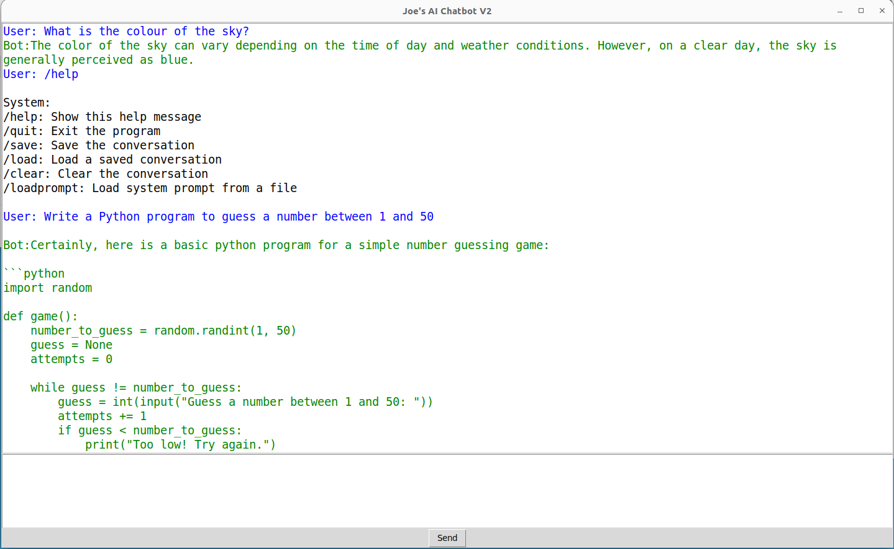

# AI-Chatbot-Python
# Open AI Chatbot

This is a simple chatbot for Open AI GPT4, written in Python.
To correctly use it, you will need to create a file called .env from the template file and add in your Open AI key to that file. Then, run it using python3 command with chat.py as an argument.



## Dependencies and Setup

This chatbot is developed in Python3, using several external libraries. Here's how you can get it set up on Ubuntu 22.04 LTS.

Firstly, install Python3 and pip if you haven't already done so:

```bash
sudo apt update
sudo apt install python3
sudo apt install python3-pip
```

Once the Python3 and pip are installed, you will need to install the following Python packages:

- `openai`
- `tkinter`
- `python-dotenv`

You can install these dependencies using pip:

```bash
pip3 install openai
sudo apt-get install python3-tk
pip3 install python-dotenv
```

You won't need to separately install the `os`, `json`, or `time` modules as they come pre-installed with Python3.

Next, clone this repository:

```bash
git clone <repo-url>
```

Rename the `dotenv_template` file to `.env`:

```bash
mv dotenv_template .env
```

Open the `.env` file with any text editor, and provide your Open AI key. It should look something like this:

```bash
OPENAI_KEY=your-key-goes-here
```

Replace "your-key-goes-here" with your actual Open AI key.

Now you're ready to run the program! Just use the `python3` command followed by the script name:

```bash
python3 chat.py
```

And that's it - the chatbot should now be up and running.

## Contribution

Feel free to fork this project and make your contribution.

## License

This project is licensed under the MIT License.

## Disclaimer

This is a basic chatbot for OpenAI and does not include any sophisticated error handling or complex features. Please use at your own discretion.

## Developer Contact 

For any suggestions or feedback or if you would like to report any bugs, please contact me at: joe@rufilla.com
